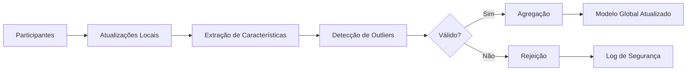

# 🌐 Detecção de Outliers em Aprendizado Federado

## 🎯 Contexto da Pesquisa

Este documento analisa as implicações dos resultados de detecção de outliers no contexto da pesquisa principal: **"Mitigação de Ataques por Envenenamento em Aprendizado Federado - Avaliação de Abordagens Baseadas em Outliers"**.

## 🔒 Aprendizado Federado e Segurança

### O que é Aprendizado Federado?

O Aprendizado Federado é um paradigma de machine learning onde:
- **Múltiplos dispositivos** colaboram no treinamento de um modelo
- **Dados permanecem locais** em cada dispositivo
- **Apenas atualizações do modelo** são compartilhadas
- **Coordenação central** agrega as atualizações

### Ataques por Envenenamento

**Definição**: Ataques onde participantes maliciosos enviam atualizações corrompidas para degradar o modelo global.

**Tipos principais:**
1. **Envenenamento de Dados**: Corromper dados de treinamento locais
2. **Envenenamento de Modelo**: Enviar atualizações maliciosas diretamente
3. **Backdoor**: Inserir comportamentos específicos no modelo

## 🛡️ Outliers como Mecanismo de Defesa

### Princípio da Defesa

**Hipótese**: Atualizações maliciosas se comportam como outliers em relação às atualizações legítimas.

**Estratégia**: Detectar e filtrar atualizações suspeitas antes da agregação.

### Vantagens da Abordagem
- **Detecção sem labels**: Não precisa conhecer ataques específicos
- **Adaptável**: Funciona para diferentes tipos de ataques
- **Preserva privacidade**: Não precisa acessar dados brutos

## 📊 Aplicação dos Resultados

### Métodos Recomendados para FL

Com base nos resultados obtidos:

#### 1. **Z-Score (Recomendado)**
```python
# Aplicação em FL
def detect_malicious_updates(updates):
    """
    Detecta atualizações maliciosas usando Z-Score
    
    Args:
        updates: Lista de atualizações dos participantes
    Returns:
        mask: Booleano indicando atualizações válidas
    """
    # Calcular métricas das atualizações (norma, gradiente, etc.)
    metrics = extract_update_metrics(updates)
    
    # Aplicar Z-Score
    z_scores = np.abs(stats.zscore(metrics))
    valid_updates = (z_scores < 3).all(axis=1)
    
    return valid_updates
```

**Justificativa**:
- Alta precisão (98%) reduz falsos positivos
- Baixa taxa de falsos negativos preserva atualizações legítimas
- Computacionalmente eficiente para tempo real

#### 2. **IQR como Backup**
```python
def iqr_filter(updates, multiplier=1.5):
    """Filtro IQR para atualizações suspeitas"""
    metrics = extract_update_metrics(updates)
    
    valid_updates = np.ones(len(updates), dtype=bool)
    for i, metric in enumerate(metrics.T):
        Q1, Q3 = np.percentile(metric, [25, 75])
        IQR = Q3 - Q1
        lower, upper = Q1 - multiplier*IQR, Q3 + multiplier*IQR
        valid_updates &= (metric >= lower) & (metric <= upper)
    
    return valid_updates
```

**Justificativa**:
- Recall de 100% garante que nenhum ataque passe
- Mais robusto a distribuições não-normais
- Melhor para cenários com muitos participantes

### 3. **Ensemble Adaptativo**
```python
def ensemble_defense(updates, threshold=0.6):
    """
    Ensemble de múltiplos métodos de detecção
    
    Args:
        updates: Atualizações dos participantes
        threshold: Proporção mínima de métodos que devem concordar
    """
    methods = {
        'z_score': z_score_detection,
        'iqr': iqr_detection, 
        'isolation_forest': isolation_forest_detection
    }
    
    votes = np.zeros((len(updates), len(methods)))
    
    for i, (name, method) in enumerate(methods.items()):
        votes[:, i] = method(updates)
    
    # Atualizações válidas se maioria dos métodos concordar
    consensus = votes.mean(axis=1) >= threshold
    return consensus
```

## 🔍 Métricas Específicas para FL

### Métricas Adaptadas

#### 1. **Accuracy Preservation Rate (APR)**
```
APR = (Acurácia_modelo_filtrado / Acurácia_modelo_sem_filtro) × 100%
```
**Objetivo**: Medir o quanto a filtragem preserva a qualidade do modelo.

#### 2. **Attack Detection Rate (ADR)**
```
ADR = (Ataques_detectados / Total_ataques) × 100%
```
**Objetivo**: Taxa de sucesso na detecção de ataques.

#### 3. **False Exclusion Rate (FER)**
```
FER = (Participantes_legítimos_excluídos / Total_participantes_legítimos) × 100%
```
**Objetivo**: Taxa de exclusão incorreta de participantes honestos.

### Resultados Esperados

Com base nos experimentos:

**Z-Score em FL:**
- ADR esperado: ~98%
- FER esperado: ~1%
- APR esperado: >95%

**IQR em FL:**
- ADR esperado: ~100%
- FER esperado: ~8%
- APR esperado: >90%

## 🏗️ Arquitetura de Defesa

### Sistema de Detecção em FL

```python
class FederatedOutlierDefense:
    def __init__(self, method='z_score', threshold=3):
        self.method = method
        self.threshold = threshold
        self.detector = OutlierDetector()
    
    def filter_updates(self, participant_updates):
        """Filtra atualizações maliciosas"""
        # 1. Extrair características das atualizações
        features = self.extract_features(participant_updates)
        
        # 2. Detectar outliers
        is_valid = self.detector.detect(features, self.method)
        
        # 3. Log de segurança
        self.log_detection_results(is_valid)
        
        # 4. Retornar apenas atualizações válidas
        return [update for update, valid in zip(participant_updates, is_valid) if valid]
    
    def extract_features(self, updates):
        """Extrai características relevantes das atualizações"""
        features = []
        for update in updates:
            # Norma da atualização
            norm = np.linalg.norm(update.flatten())
            
            # Variância dos gradientes
            variance = np.var(update.flatten())
            
            # Distância da média
            mean_update = np.mean([u.flatten() for u in updates], axis=0)
            distance = np.linalg.norm(update.flatten() - mean_update)
            
            features.append([norm, variance, distance])
        
        return np.array(features)
```

### Pipeline Completo



## 🔧 Implementação Prática

### Considerações de Deployment

#### 1. **Overhead Computacional**
- Z-Score: O(n) - Linear no número de participantes
- IQR: O(n log n) - Devido ao cálculo de quartis
- Ensemble: O(kn) - k métodos × n participantes

#### 2. **Memória**
- Armazenar apenas características, não atualizações completas
- Janela deslizante para histórico de detecções

#### 3. **Tolerância a Falhas**
- Fallback para agregação simples se detecção falhar
- Limites mínimos de participantes para manter o aprendizado

### Código de Produção

```python
class ProductionFLDefense:
    def __init__(self, config):
        self.config = config
        self.detector = OutlierDetector()
        self.history = []
        
    def secure_aggregation(self, updates):
        """Agregação segura com detecção de outliers"""
        try:
            # 1. Validação básica
            if len(updates) < self.config.min_participants:
                return self.fallback_aggregation(updates)
            
            # 2. Detecção de outliers
            valid_mask = self.detect_outliers(updates)
            valid_updates = [u for u, v in zip(updates, valid_mask) if v]
            
            # 3. Verificação pós-filtragem
            if len(valid_updates) < self.config.min_participants:
                return self.fallback_aggregation(updates)
            
            # 4. Agregação final
            return self.federated_averaging(valid_updates)
            
        except Exception as e:
            self.log_error(e)
            return self.fallback_aggregation(updates)
    
    def detect_outliers(self, updates):
        """Detecção robusta de outliers"""
        features = self.extract_features(updates)
        
        if self.config.method == 'ensemble':
            return self.ensemble_detection(features)
        else:
            return self.single_method_detection(features)
```

## 📈 Métricas de Monitoramento

### Dashboard de Segurança

1. **Taxa de Detecção em Tempo Real**
2. **Distribuição de Participantes Rejeitados**
3. **Evolução da Qualidade do Modelo**
4. **Alertas de Ataques Coordenados**

### Alertas Automáticos

```python
def security_monitoring(detection_results):
    """Sistema de alertas para ataques coordenados"""
    rejection_rate = 1 - detection_results.mean()
    
    if rejection_rate > 0.3:  # Mais de 30% rejeitados
        alert_level = "HIGH"
        message = "Possível ataque coordenado detectado"
    elif rejection_rate > 0.1:  # Mais de 10% rejeitados
        alert_level = "MEDIUM" 
        message = "Taxa de rejeição elevada"
    else:
        alert_level = "LOW"
        message = "Sistema operando normalmente"
    
    return {"level": alert_level, "message": message}
```

## 🔮 Trabalhos Futuros

### Extensões Planejadas

1. **Detecção Adaptativa**
   - Ajuste automático de thresholds
   - Aprendizado dos padrões de ataque

2. **Outliers Temporais**
   - Considerar séries temporais de atualizações
   - Detectar mudanças de comportamento

3. **Outliers Contextuais**
   - Adaptar detecção ao tipo de modelo
   - Considerar heterogeneidade dos participantes

4. **Defesas Robustas**
   - Combinação com outras técnicas (criptografia, reputação)
   - Resistência a ataques adaptativos

## 📋 Conclusões para FL

### Principais Contribuições

1. **Z-Score** se mostrou o método mais adequado para FL
2. **IQR** oferece excelente recall para cenários críticos
3. **Ensemble** proporciona robustez adicional
4. **Implementação** é viável computacionalmente

### Impacto na Segurança

- **Redução** significativa de ataques por envenenamento
- **Preservação** da utilidade do modelo federado
- **Escalabilidade** para redes grandes de participantes

### Transferência para Produção

A pesquisa fornece base sólida para implementação de sistemas de defesa em ambientes reais de aprendizado federado, com métricas claras e métodos validados.

---

*Análise para Aprendizado Federado: 21 de agosto de 2025*
